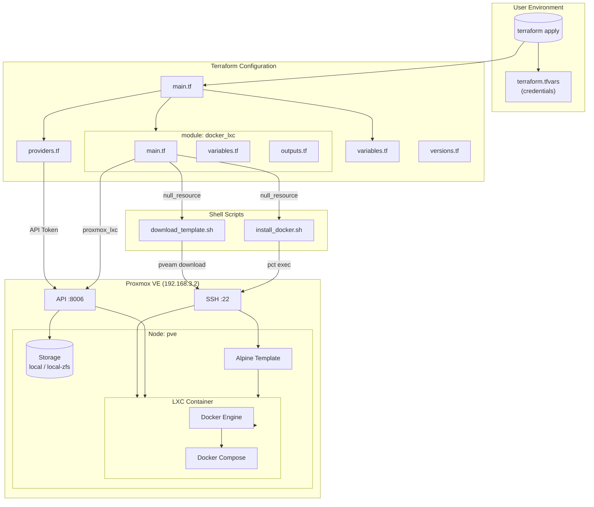

# Architecture

## Infrastructure Diagram

## Execution Flow

```mermaid
sequenceDiagram
    autonumber
    participant U as User
    participant TF as Terraform
    participant API as Proxmox API
    participant SSH as Proxmox SSH
    participant LXC as LXC Container

    U->>TF: terraform apply
    TF->>TF: Load variables from terraform.tfvars
    
    rect rgb(40, 40, 60)
        Note over TF,SSH: Phase 1: Download Template
        TF->>SSH: null_resource: download_template.sh
        SSH->>SSH: pveam list (check if exists)
        SSH->>SSH: pveam download (if needed)
    end

    rect rgb(40, 60, 40)
        Note over TF,LXC: Phase 2: Create Container
        TF->>API: proxmox_lxc.docker
        API->>LXC: Create LXC (Alpine)
        API->>LXC: Configure: cores, memory, network
        API->>LXC: Start container
    end

    rect rgb(60, 40, 40)
        Note over TF,LXC: Phase 3: Install Docker
        TF->>SSH: null_resource: install_docker.sh
        SSH->>LXC: pct exec: apk update
        SSH->>LXC: pct exec: apk add docker
        SSH->>LXC: pct exec: rc-update add docker
        SSH->>LXC: pct exec: service docker start
    end

    TF->>U: Output: container_id, hostname, ip
```

## Component Overview

| Component | Purpose |
|-----------|---------|
| `main.tf` | Root module configuration, instantiates docker_lxc module |
| `providers.tf` | Proxmox provider configuration with API credentials |
| `variables.tf` | Input variables for Docker LXC configuration |
| `modules/docker_lxc/` | Reusable module for LXC containers with Docker |
| `scripts/download_template.sh` | Downloads Alpine template via SSH if not present |
| `scripts/install_docker.sh` | Installs Docker inside LXC container via pct exec |

