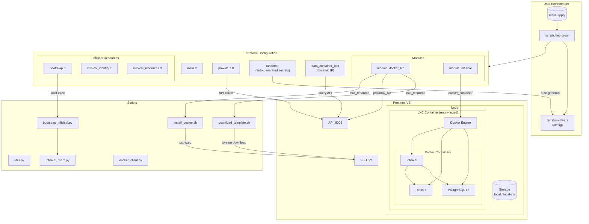

# Architecture

## Infrastructure Diagram



## Execution Flow

```mermaid
sequenceDiagram
    autonumber
    participant U as User
    participant D as deploy.py
    participant TF as Terraform
    participant API as Proxmox API
    participant SSH as Proxmox SSH
    participant LXC as LXC Container
    participant INF as Infisical

    U->>D: make apply
    D->>D: Check dependencies
    D->>TF: terraform init
    
    rect rgb(40, 40, 60)
        Note over D,LXC: Phase 1: Deploy LXC + Get IP
        D->>TF: apply -target=module.docker_lxc
        TF->>API: Create LXC (unprivileged)
        API->>LXC: Start container
        TF->>SSH: install_docker.sh
        SSH->>LXC: Install Docker + SSH
        TF->>API: Query /lxc/{vmid}/interfaces
        API-->>TF: Return eth0 IP (DHCP)
    end

    rect rgb(40, 60, 40)
        Note over D,INF: Phase 2: Deploy Infisical
        D->>TF: apply -target=module.infisical
        TF->>LXC: Create PostgreSQL container
        TF->>LXC: Create Redis container
        TF->>LXC: Create Infisical container
        LXC->>INF: Start Infisical
    end

    rect rgb(60, 40, 40)
        Note over D,INF: Phase 3: Bootstrap
        D->>TF: null_resource.bootstrap_infisical
        TF->>D: Run bootstrap_infisical.py
        D->>INF: POST /api/v1/admin/bootstrap
        INF-->>D: Return admin token + org_id
        D->>D: Save to infisical_bootstrap.auto.tfvars
    end

    rect rgb(60, 60, 40)
        Note over D,INF: Phase 4: Create Machine Identity
        D->>TF: apply (infisical_identity resources)
        TF->>INF: Create Machine Identity
        TF->>INF: Attach Universal Auth
        TF->>INF: Generate Client Secret
        TF->>D: Save to infisical_token.auto.tfvars
    end

    TF->>U: Output: IP, URL, status
```



## Component Overview

| Component | Purpose |
|-----------|---------|
| `main.tf` | Root module, instantiates docker_lxc and infisical modules |
| `providers.tf` | Proxmox and Docker provider configuration |
| `random.tf` | Auto-generates passwords (docker_lxc, postgres, infisical) |
| `data_container_ip.tf` | Gets container IP dynamically from Proxmox API |
| `bootstrap.tf` | Orchestrates Infisical bootstrap via Python script |
| `infisical_identity.tf` | Creates Machine Identity with Universal Auth |
| `infisical_resources.tf` | Manages Infisical projects and secrets |
| `modules/docker_lxc/` | Creates unprivileged LXC with Docker |
| `modules/infisical/` | Deploys Infisical stack (PostgreSQL, Redis, Infisical) |
| `scripts/deploy.py` | Main orchestration script |
| `scripts/bootstrap_infisical.py` | Performs initial Infisical bootstrap |

## Auto-Generated Credentials

| Credential | Resource | Length | Purpose |
|------------|----------|--------|---------|
| `docker_lxc_password` | `random_password.docker_lxc` | 16 | LXC container root password |
| `infisical_admin_password` | `random_password.infisical_admin` | 24 | Infisical admin user |
| `postgres_password` | `random_password.postgres` | 32 | PostgreSQL database |
| `encryption_key` | `random_bytes.encryption_key` | 16 bytes (32 hex) | AES-256 encryption |
| `jwt_signing_key` | `random_password.jwt_signing_key` | 32 | JWT token signing |

## Network Flow

```
User (192.168.3.x)
    │
    ├──► Proxmox API (192.168.3.2:8006) ──► Terraform Provider
    │
    ├──► Proxmox SSH (192.168.3.2:22) ──► Shell Scripts (pct exec)
    │
    └──► Docker LXC (192.168.3.x:8080) ──► Infisical Web UI
              │
              ├── PostgreSQL (internal:5432)
              └── Redis (internal:6379)
```
